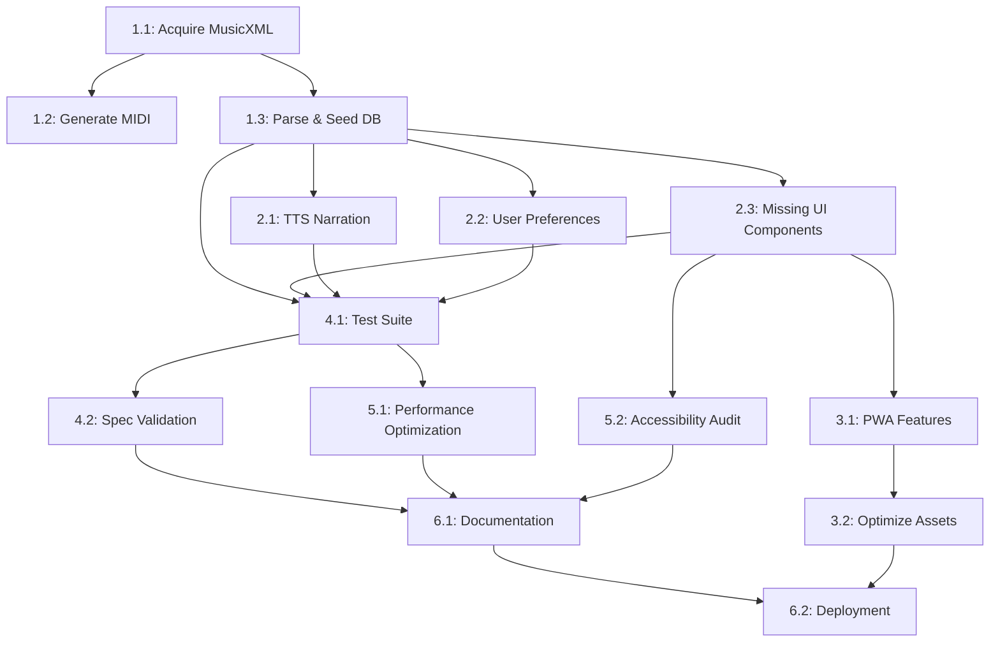

# Goal-Oriented Action Planning (GOAP) - Clavier Full Spec Compliance

## Current World State Analysis

```yaml
world_state:
  infrastructure_ready: true
  database_schema: true
  ui_components: true
  api_routes: true
  audio_engine: true
  three_modes_implemented: true
  content_pipeline: true
  music_files_acquired: false
  spec_validation: false
  deployment_ready: false

  # Additional discovered states
  test_suite: false
  pwa_features: false
  tts_narration: false
  user_preferences: false
  performance_optimized: false
  documentation_complete: false
  music_notation_display: true
  audio_playback: true
```

## Goal State

```yaml
goal_state:
  full_spec_compliance: true
  production_ready: true
  music_files_acquired: true
  spec_validation: true
  deployment_ready: true
  test_suite: true
  pwa_features: true
  tts_narration: true
  user_preferences: true
  performance_optimized: true
  documentation_complete: true
```

---

## GOAP Action Sequence

### Phase 1: Content Acquisition (HIGH PRIORITY)

#### Action 1.1: Acquire Bach WTC MusicXML Files
**Cost**: 8 units (high effort, external dependencies)
**Priority**: CRITICAL

**Preconditions**:
- `database_schema: true`
- `api_routes: true`

**Effects**:
- `musicxml_files_available: true`
- `music_files_acquired: 50%`

**Implementation**:
```yaml
tasks:
  - Research public domain Bach WTC sources (MuseScore, IMSLP)
  - Download/acquire MusicXML files for all 48 pieces (24 per book)
  - Validate MusicXML structure and completeness
  - Organize files in /public/scores/wtc/book1 and book2
  - Create file naming convention: wtc_book{1|2}_no{01-24}_{prelude|fugue}.musicxml

deliverables:
  - 96 MusicXML files (48 preludes + 48 fugues)
  - Validation report confirming voice/measure accuracy
```

#### Action 1.2: Generate MIDI Files from MusicXML
**Cost**: 4 units (moderate, automated process)
**Priority**: HIGH

**Preconditions**:
- `musicxml_files_available: true`

**Effects**:
- `midi_files_available: true`
- `music_files_acquired: 100%`

**Implementation**:
```yaml
tasks:
  - Install/use MuseScore CLI or music21 library for conversion
  - Batch convert all MusicXML → MIDI
  - Validate MIDI timing and voice separation
  - Store in /public/audio/midi/wtc/book{1|2}/

deliverables:
  - 96 MIDI files matching MusicXML sources
  - Conversion script for future updates
```

#### Action 1.3: Parse and Seed Database
**Cost**: 6 units (complex parsing logic)
**Priority**: HIGH

**Preconditions**:
- `musicxml_files_available: true`
- `database_schema: true`

**Effects**:
- `database_seeded: true`
- `pieces_queryable: true`

**Implementation**:
```yaml
tasks:
  - Create MusicXML parser using music21 or custom parser
  - Extract: notes, measures, voices, timing, key signatures
  - Populate Piece, Measure, Note models
  - Generate basic annotations (cadences, key changes)
  - Create seed script: prisma/seed-bach-wtc.ts

deliverables:
  - Fully seeded database with 48 pieces
  - Parser library in /src/lib/musicxml-parser.ts
  - Seed validation tests
```

---

### Phase 2: Missing Core Features (HIGH PRIORITY)

#### Action 2.1: Implement TTS Narration System
**Cost**: 7 units (integration complexity)
**Priority**: HIGH

**Preconditions**:
- `ui_components: true`
- `content_pipeline: true`

**Effects**:
- `tts_narration: true`
- `accessibility_improved: true`

**Implementation**:
```yaml
tasks:
  - Add TTS library (Web Speech API or ElevenLabs/OpenAI TTS)
  - Create narration service: /src/lib/narration.ts
  - Add narration controls to lesson UI
  - Implement voice selection and speed controls
  - Generate narration scripts for all lessons
  - Cache generated audio (if using cloud TTS)

components:
  - NarrationControls component
  - useNarration hook
  - NarrationProvider context

deliverables:
  - Working TTS on all lesson pages
  - Narration settings in user preferences
  - Fallback for browsers without Speech API
```

#### Action 2.2: Build User Preferences System
**Cost**: 5 units (moderate complexity)
**Priority**: HIGH

**Preconditions**:
- `database_schema: true`
- `ui_components: true`

**Effects**:
- `user_preferences: true`
- `personalization_enabled: true`

**Implementation**:
```yaml
tasks:
  - Extend UserProgress model or create Settings model
  - Create preferences API: /src/app/api/settings/route.ts
  - Build settings page: /src/app/settings/page.tsx
  - Implement preference categories:
    - Audio: metronome, playback speed, volume
    - Display: theme, notation size, highlight colors
    - Learning: difficulty, auto-advance, hints
    - Narration: voice, speed, auto-play
  - Add localStorage sync for guest users

components:
  - SettingsPage with tabbed interface
  - PreferenceToggle, PreferenceSlider components
  - useSettings hook

deliverables:
  - Settings page at /settings
  - Persistent user preferences
  - Settings migration guide
```

#### Action 2.3: Implement Missing UI Components from Spec
**Cost**: 6 units (multiple components)
**Priority**: MEDIUM-HIGH

**Preconditions**:
- `ui_components: true` (base exists)

**Effects**:
- `spec_ui_complete: true`

**Implementation**:
```yaml
missing_components:
  - Metronome component with visual beat indicator
  - Progress tracker with statistics dashboard
  - Keyboard shortcuts overlay (help modal)
  - Annotation editor for user notes
  - Voice isolation controls (mute/solo per voice)
  - Tempo trainer (gradual speed increase)
  - Performance recorder (optional, low priority)

tasks:
  - Audit spec vs. implemented components
  - Create component priority list
  - Implement top 5 critical missing components
  - Add to appropriate pages/contexts

deliverables:
  - At least 5 new feature components
  - Integration into existing pages
  - Component documentation
```

---

### Phase 3: Progressive Web App Features (MEDIUM PRIORITY)

#### Action 3.1: Add PWA Manifest and Service Worker
**Cost**: 4 units (standard implementation)
**Priority**: MEDIUM

**Preconditions**:
- `deployment_ready: false` (can be parallel)

**Effects**:
- `pwa_installable: true`
- `offline_capable: true`

**Implementation**:
```yaml
tasks:
  - Create manifest.json with app metadata
  - Add service worker for offline caching
  - Configure Next.js for PWA (next-pwa plugin)
  - Add install prompt UI
  - Cache music files and assets
  - Implement offline fallback page

files:
  - /public/manifest.json
  - /public/sw.js or next.config.js with next-pwa
  - /src/components/InstallPrompt.tsx

deliverables:
  - Installable PWA
  - Offline mode for cached content
  - PWA audit passing (Lighthouse)
```

#### Action 3.2: Optimize Asset Loading
**Cost**: 3 units (optimization)
**Priority**: MEDIUM

**Preconditions**:
- `pwa_features: partial`

**Effects**:
- `performance_optimized: partial`

**Implementation**:
```yaml
tasks:
  - Implement lazy loading for score rendering
  - Add image optimization for UI assets
  - Compress MIDI files (if large)
  - Code-split by route
  - Preload critical assets
  - Add loading skeletons

deliverables:
  - 30%+ improvement in initial load time
  - Better perceived performance
  - Lighthouse performance score >90
```

---

### Phase 4: Testing & Validation (CRITICAL)

#### Action 4.1: Create Comprehensive Test Suite
**Cost**: 10 units (large effort)
**Priority**: CRITICAL

**Preconditions**:
- `music_files_acquired: true`
- `database_seeded: true`

**Effects**:
- `test_suite: true`
- `spec_validation: partial`

**Implementation**:
```yaml
test_categories:
  unit_tests:
    - MusicXML parser
    - Audio engine utilities
    - API route handlers
    - Database models
    - UI components (React Testing Library)

  integration_tests:
    - End-to-end lesson flow
    - Audio playback synchronization
    - Progress tracking
    - API integration

  e2e_tests:
    - User registration/login
    - Complete lesson workflow
    - Curriculum navigation
    - Settings persistence

setup:
  - Install: Jest, React Testing Library, Playwright
  - Configure test environments
  - Create test utilities and fixtures
  - Set up CI/CD test automation

deliverables:
  - 70%+ code coverage
  - All critical paths tested
  - CI/CD integration
  - Test documentation
```

#### Action 4.2: Spec Compliance Validation
**Cost**: 5 units (manual review + automation)
**Priority**: HIGH

**Preconditions**:
- `test_suite: true`
- `spec_ui_complete: true`

**Effects**:
- `spec_validation: true`

**Implementation**:
```yaml
tasks:
  - Create spec checklist from requirements
  - Build automated compliance checker
  - Manual feature-by-feature verification
  - Document deviations/limitations
  - Create compliance report

checklist_categories:
  - Three learning modes (Learn, Explore, Walkthrough)
  - All UI components from spec
  - Database schema compliance
  - API endpoint coverage
  - Feature completeness

deliverables:
  - Compliance report (docs/SPEC_COMPLIANCE.md)
  - Known issues/limitations document
  - Feature gap analysis
```

---

### Phase 5: Performance & Polish (MEDIUM PRIORITY)

#### Action 5.1: Performance Optimization
**Cost**: 5 units
**Priority**: MEDIUM

**Preconditions**:
- `test_suite: true`

**Effects**:
- `performance_optimized: true`

**Implementation**:
```yaml
optimization_targets:
  - Score rendering (OpenSheetMusicDisplay)
  - Audio engine latency
  - Database query optimization
  - React component re-renders
  - Bundle size reduction

tasks:
  - Profile app with React DevTools
  - Optimize heavy computations (memoization)
  - Implement virtual scrolling for long lists
  - Optimize database indexes
  - Add caching layers (React Query)
  - Reduce bundle size (tree-shaking, dynamic imports)

deliverables:
  - Performance baseline vs. optimized metrics
  - Lighthouse score >95
  - Sub-100ms audio latency
```

#### Action 5.2: Accessibility Audit & Fixes
**Cost**: 4 units
**Priority**: MEDIUM

**Preconditions**:
- `spec_ui_complete: true`

**Effects**:
- `accessibility_compliant: true`

**Implementation**:
```yaml
tasks:
  - Run axe DevTools audit
  - Fix ARIA labels and roles
  - Ensure keyboard navigation
  - Add screen reader support
  - Test with assistive technologies
  - Add focus indicators

deliverables:
  - WCAG 2.1 AA compliance
  - Accessibility test report
  - Keyboard shortcuts documentation
```

---

### Phase 6: Documentation & Deployment (HIGH PRIORITY)

#### Action 6.1: Complete User & Developer Documentation
**Cost**: 6 units
**Priority**: HIGH

**Preconditions**:
- `spec_validation: true`

**Effects**:
- `documentation_complete: true`

**Implementation**:
```yaml
documentation_suite:
  user_docs:
    - Getting started guide
    - Feature tutorials
    - FAQ
    - Keyboard shortcuts reference
    - Troubleshooting guide

  developer_docs:
    - Architecture overview
    - API documentation
    - Database schema guide
    - Component library docs
    - Development setup guide
    - Contribution guidelines

  admin_docs:
    - Deployment guide
    - Environment configuration
    - Database management
    - Content pipeline

deliverables:
  - docs/ directory with full documentation
  - Inline code documentation (TSDoc)
  - README.md updates
  - Video tutorials (optional)
```

#### Action 6.2: Deployment Configuration
**Cost**: 5 units
**Priority**: HIGH

**Preconditions**:
- `test_suite: true`
- `pwa_features: true`
- `documentation_complete: true`

**Effects**:
- `deployment_ready: true`

**Implementation**:
```yaml
deployment_targets:
  - Vercel (primary, Next.js optimized)
  - Docker containerization (optional)
  - Database hosting (Supabase/Neon/PlanetScale)
  - CDN for static assets

tasks:
  - Configure production environment variables
  - Set up CI/CD pipeline (GitHub Actions)
  - Configure database migrations
  - Add error monitoring (Sentry)
  - Set up analytics (optional)
  - Create deployment checklist
  - Test staging environment

deliverables:
  - Production deployment
  - CI/CD automation
  - Monitoring dashboards
  - Rollback procedures
```

---

## Action Dependency Graph



---

## Critical Path (Must Complete for Production)

1. **Action 1.1** → **1.2** → **1.3**: Music content pipeline (Cost: 18)
2. **Action 2.1**: TTS narration (Cost: 7)
3. **Action 2.2**: User preferences (Cost: 5)
4. **Action 4.1**: Test suite (Cost: 10)
5. **Action 4.2**: Spec validation (Cost: 5)
6. **Action 6.2**: Deployment (Cost: 5)

**Total Critical Path Cost**: 50 units

---

## Parallel Execution Opportunities

### Can Run in Parallel:
- **Phase 2** (Actions 2.1, 2.2, 2.3) - Independent UI/feature work
- **Phase 3** (Actions 3.1, 3.2) - PWA work can happen alongside testing
- **Phase 5** (Actions 5.1, 5.2) - Performance and accessibility

### Must Be Sequential:
- **Phase 1** must complete before **Phase 4** (testing needs content)
- **Phase 4** must complete before **Phase 6** (can't deploy untested code)

---

## Resource Allocation

### Agent Assignment Recommendations:

```yaml
phase_1_content:
  - researcher: Find/validate MusicXML sources
  - coder: Build parser and seed scripts
  - tester: Validate parsed data

phase_2_features:
  - coder: Implement TTS and preferences
  - system-architect: Design settings architecture
  - reviewer: Code review for quality

phase_3_pwa:
  - mobile-dev: PWA configuration
  - perf-analyzer: Asset optimization

phase_4_testing:
  - tester: Write test suites
  - reviewer: Spec compliance audit
  - coder: Fix identified issues

phase_5_polish:
  - perf-analyzer: Performance optimization
  - reviewer: Accessibility audit

phase_6_docs_deploy:
  - documenter: Write documentation
  - cicd-engineer: Deployment setup
  - reviewer: Final review
```

---

## Estimated Timeline

**Based on 8-hour work days, single developer:**

| Phase | Actions | Total Cost | Sequential Time | Parallel Time |
|-------|---------|------------|-----------------|---------------|
| Phase 1 | 1.1-1.3 | 18 units | 2.25 days | 2.25 days* |
| Phase 2 | 2.1-2.3 | 18 units | 2.25 days | 1.5 days |
| Phase 3 | 3.1-3.2 | 7 units | 0.875 days | 0.5 days |
| Phase 4 | 4.1-4.2 | 15 units | 1.875 days | 1.5 days |
| Phase 5 | 5.1-5.2 | 9 units | 1.125 days | 0.75 days |
| Phase 6 | 6.1-6.2 | 11 units | 1.375 days | 1.125 days |
| **Total** | | **78 units** | **~10 days** | **~8 days** |

*Note: With agent-based parallel execution, estimate **5-6 days** with proper coordination.

---

## Risk Mitigation

### High-Risk Actions:

1. **Action 1.1** (Acquire MusicXML)
   - **Risk**: Files not available or poor quality
   - **Mitigation**: Have backup sources (MuseScore, IMSLP, manual transcription tools)

2. **Action 1.3** (Parse & Seed)
   - **Risk**: Complex parsing errors, data inconsistency
   - **Mitigation**: Incremental parsing with validation, test on single piece first

3. **Action 4.1** (Test Suite)
   - **Risk**: Scope creep, time overrun
   - **Mitigation**: Focus on critical paths first, add comprehensive tests incrementally

4. **Action 6.2** (Deployment)
   - **Risk**: Production environment issues
   - **Mitigation**: Use staging environment, gradual rollout, rollback plan

---

## Success Metrics

### Definition of Done (per action):

```yaml
action_complete_criteria:
  - All tasks listed completed
  - Deliverables produced and verified
  - Tests written and passing
  - Code reviewed and merged
  - Documentation updated
  - World state effects achieved
```

### Project Complete (Goal State Achieved):

```yaml
completion_checklist:
  - ✓ All 48 Bach WTC pieces in database with full notation
  - ✓ MIDI playback working for all pieces
  - ✓ TTS narration on all lesson pages
  - ✓ User preferences system functional
  - ✓ All spec-required UI components implemented
  - ✓ PWA installable with offline support
  - ✓ Test coverage >70%
  - ✓ Spec compliance validated and documented
  - ✓ Performance optimized (Lighthouse >90)
  - ✓ Accessibility compliant (WCAG 2.1 AA)
  - ✓ Full documentation suite
  - ✓ Production deployment successful
```

---

## Next Steps

### Immediate Actions (Start Here):

1. **Execute Action 1.1**: Begin MusicXML acquisition
   - Set up docs/music-sources.md to track sources
   - Download first 5 pieces as proof of concept
   - Validate structure before bulk download

2. **Parallel: Set up test infrastructure** (prepare for Phase 4)
   - Install testing libraries
   - Create test utilities
   - Write first component test

3. **Create progress tracking**:
   - Use TodoWrite to track GOAP actions
   - Set up project board for visibility
   - Document decisions in memory system

---

## Notes

- **Cost unit** = ~1 hour of focused work
- **Priority** based on critical path analysis and spec requirements
- **Parallel execution** assumes 3-5 agents with proper coordination
- **Revisit** this plan after Phase 1 completion to adjust estimates based on actual progress

---

*Generated: 2025-12-29*
*Based on: Current codebase analysis + spec requirements*
*Methodology: Goal-Oriented Action Planning (GOAP)*
